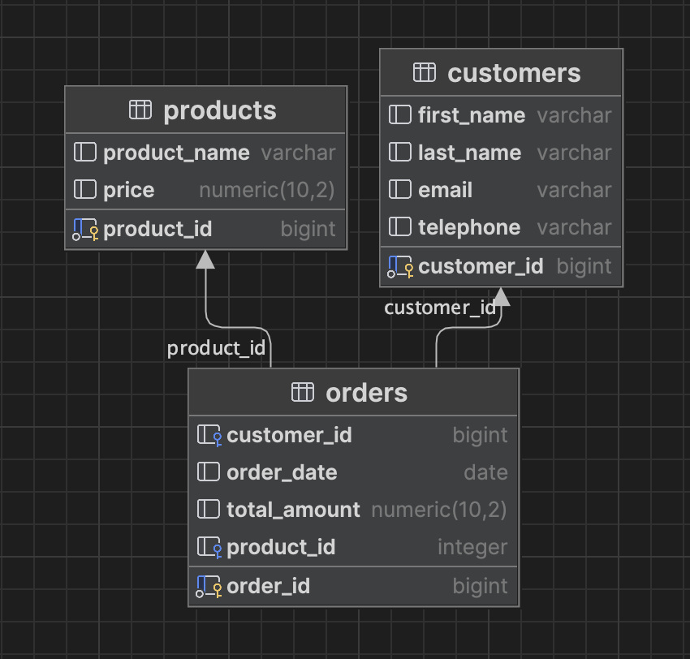

# Data Engineer Journey

This is my Data Eng journy....

- [Data Engineer Journey](#data-engineer-journey)
  - [Junior](#junior)
    - [Fundamental SQL concepts](#fundamental-sql-concepts)
      - [SELECT](#select)
      - [INSERT](#insert)
      - [UPDATE](#update)
      - [DELETE](#delete)
      - [ALTER](#alter)
    - [Database Basics](#database-basics)
      - [JOINS](#joins)
        - [INNER JOIN](#inner-join)
        - [LEFT JOIN](#left-join)
        - [RIGHT JOIN](#right-join)
    - [Mid-Level](#mid-level)
    - [Lead](#lead)
  - [Projects](#projects)
  - [Videos](#videos)

## Junior

### Fundamental SQL concepts

The table that I will be using here:

**users_table**

| id  | name         | email                |
| --- | ------------ | -------------------- |
| 1   | John Doe     | <john@example.com>   |
| 2   | Jane Smith   | <jane@example.com>   |
| 3   | Robert Brown | <robert@example.com> |

#### SELECT

```sql
SELECT id, name
FROM users_table
WHERE name like 'J%';
```

The above query would return

| ID  | Name       |
| --- | ---------- |
| 1   | John Doe   |
| 2   | Jane Smith |

#### INSERT

```sql
INSERT INTO users_table (id, name, email)
VALUES (4, 'Jonny Appleseed', 'jonny@example.com');
```

The above would make the table as follows

| id  | name            | email                |
| --- | --------------- | -------------------- |
| 1   | John Doe        | <john@example.com>   |
| 2   | Jane Smith      | <jane@example.com>   |
| 3   | Robert Brown    | <robert@example.com> |
| 4   | Jonny Appleseed | <jonny@example.com>  |

#### UPDATE

```sql
UPDATE users_table
SET name = 'Joe Bloggs', email = 'joe@example.com'
WHERE id = 4
```

This would return the following table as I have changed the name of user id 4

| id  | name         | email                |
| --- | ------------ | -------------------- |
| 1   | John Doe     | <john@example.com>   |
| 2   | Jane Smith   | <jane@example.com>   |
| 3   | Robert Brown | <robert@example.com> |
| 4   | Joe Bloggs   | <joe@example.com>    |

#### DELETE

```sql
DELETE FROM users_table where id = 4
```

This would return, as we have removed user with id 4 from the table.

| id  | name         | email                |
| --- | ------------ | -------------------- |
| 1   | John Doe     | <john@example.com>   |
| 2   | Jane Smith   | <jane@example.com>   |
| 3   | Robert Brown | <robert@example.com> |

#### ALTER

This is going to add a new col to the `users_table` a col called `phone` that is
type `varchar`.

```sql
ALTER TABLE users_table
ADD phone varchar;
```

This renames the col `phone` to `telephone`

```sql
ALTER TABLE users_table
RENAME COLUMN phone to telephone;
```

This removes the col `telephone` from the `users_table`

```sql
ALTER TABLE users_table
DROP COLUMN telephone;
```

### Database Basics

**Relational Database Concepts**: A relational database is a type of database
that organizes data into tables, which are composed of rows (also known as
records) and columns (also known as fields). Each row represents a unique
instance of the entity being modeled, and each column represents a specific
attribute or piece of data associated with that entity.

**Primary Key**: A primary key is a column in a table that uniquely identifies
each row in that table. It ensures that each row is distinct and can be uniquely
identified. Primary keys are essential for maintaining data integrity and for
establishing relationships between tables

**Foreign Key**: A foreign key is a column in one table that refers to the
primary key in another table. It establishes a relationship between two tables,
where the values in the foreign key column of one table match the values in the
primary key column of another table. This relationship allows data to be linked
across tables, enabling the creation of meaningful associations between
different entities.

**Primary/Foreign Key Relationships**: A primary key and a foreign key establish
a relationship between two tables. This relationship is often referred to as a
parent-child relationship. The table containing the primary key is the parent
table, and the table containing the foreign key is the child table. The primary
key in the parent table serves as a unique identifier for each record, and the
foreign key in the child table references the corresponding record in the parent
table.

For example:



The `orders` table would be considered our main table in this situation. This
table has relationships with the `products` and `customers` table via foreign
keys. The orders table has an `FK` of `customer_id` this allows the orders table
to have a relatioship with the `customers` table enabling the user to join data
from `customers` to `orders`

The same goes for the `FK` `product_id` which enables the relationship with the
`products` table.

Here is a code example using Postgres:

```sql
CREATE TABLE customers (
    customer_id SERIAL PRIMARY KEY,
    first_name VARCHAR(50),
    last_name VARCHAR(50),
    email VARCHAR(100) UNIQUE,
    telphone VARCHAR(50) UNIQUE
);

CREATE TABLE products (
    product_id SERIAL PRIMARY KEY,
    product_name VARCHAR(255),
    price FLOAT,
)

CREATE TABLE orders (
    order_id SERIAL PRIMARY KEY,
    customer_id INT,
    order_date DATE,
    product_id INT,
    -- Other columns in the orders table
    CONSTRAINT fk_customer
    FOREIGN KEY (customer_id) REFERENCES customers (customer_id),

    CONSTRAINT fk_products
    FOREIGN KEY (product_id) REFERENCES products (product_id)
);
```

#### JOINS

Joins are used to combine data from two or more tables in a database based on a
related column between them. Joins allow you to retrieve information from
multiple tables in a single query, making it possible to get a more
comprehensive view of your data.

**Example tables**

`customers`

```txt
+----+----------+
| ID | Name     |
+----+----------+
| 1  | Alice    |
| 2  | Bob      |
| 3  | Carol    |
+----+----------+
```

`orders`

```txt
+----------+------------+
| OrderID  | CustomerID |
+----------+------------+
| 101      | 1          |
| 102      | 2          |
| 103      | 1          |
| 104      | 4          |
+----------+------------+

```

##### INNER JOIN

An `INNER JOIN` returns only the rows where there is a match in both tables
based on the specified condition.

```sql
SELECT customers.Name, orders.OrderID
FROM customers
INNER JOIN orders ON customers.ID = orders.CustomerID;
```

**Result**

```txt
+----------+----------+
| Name     | OrderID  |
+----------+----------+
| Alice    | 101      |
| Bob      | 102      |
| Alice    | 103      |
+----------+----------+
```

##### LEFT JOIN

A `LEFT JOIN` returns all rows from the left (first) table and the matching rows
from the right (second) table. If there's no match, `NULL` values are returned
for the columns of the right table.

```sql
SELECT customers.Name, orders.OrderID
FROM customers
LEFT JOIN orders ON customers.ID = orders.CustomerID;
```

**Result**

```txt
+----------+----------+
| Name     | OrderID  |
+----------+----------+
| Alice    | 101      |
| Bob      | 102      |
| Alice    | 103      |
| Carol    | NULL     |
+----------+----------+
```

##### RIGHT JOIN

A `RIGHT JOIN` is similar to a `LEFT JOIN`, but it returns all rows from the
right (second) table and the matching rows from the left (first) table. If
there's no match, NULL values are returned for the columns of the left table.

```sql
SELECT customers.Name, orders.OrderID
FROM customers
RIGHT JOIN orders ON customers.ID = orders.CustomerID;
```

**Result**

```txt
+----------+----------+
| Name     | OrderID  |
+----------+----------+
| Alice    | 101      |
| Bob      | 102      |
| Alice    | 103      |
| NULL     | 104      |
+----------+----------+
```

### Mid-Level

### Lead

## Projects

A selection of repos where I have built projects to harness my learnings

- [Basic data processing via API into Postgres](https://github.com/mrpbennett/basic_dataeng_proj)
- [My first ETL pipeline using Postgres & Redis)(https://github.com/mrpbennett/etl-pipeline)

## Videos

A selection of videos I have watched during my learning.

- [Python Libraries You Should Know As A Data Engineer](https://youtu.be/LBs7w770RQM)
