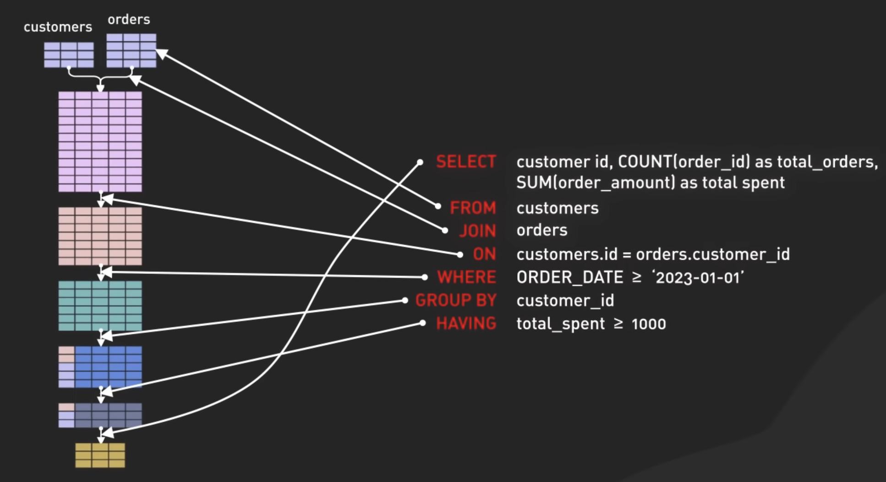

# Visualising SQL query execution order

Visualising thr SQL query execution order

Seeing the execution order explains why you're unable to use aliases in a
`WHERE` clause. As the `SELECT` statement is run last.

Therefor the alias does not exist when the `WHERE` claus is executed.

[YT Link](https://youtu.be/BHwzDmr6d7s)
