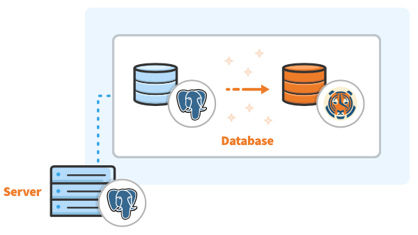

# Installing TimescaleDB via Docker 

Start a TimescaleDB instance, pulling our Docker image from Docker Hub if it has not been already installed:

```bash
docker run -d --name timescaledb -p 5432:5432 -e POSTGRES_PASSWORD=password timescale/timescaledb:2.0.1-pg12
```

**WARNING**:The -p flag binds the container port to the host port, meaning anything that can access the host port will be able to access your TimescaleDB container. This can be particularly dangerous if you do not set a PostgreSQL password at runtime using the POSTGRES_PASSWORD environment variable as we do in the above command.

If you have PostgreSQL client tools (e.g., psql) installed locally, you can use those to access the TimescaleDB docker instance. Otherwise, and probably simpler given default PostgreSQL access-control settings, you can connect using the instance's version of psql within the container.

```bash
docker exec -it timescaledb psql -U postgres
```

## Setup



First connect to the PostgreSQL instance:
```bash
# Connect to PostgreSQL, using a superuser named 'postgres'
psql -U postgres -h localhost
```

Now create a new empty database (skip this if you already have a database):
```bash
-- Create the database, let's call it 'tutorial'
CREATE database <db name>;
```
Lastly add TimescaleDB:

```bash
-- Connect to the database
\c <db name>

-- Extend the database with TimescaleDB
CREATE EXTENSION IF NOT EXISTS timescaledb;
```

That's it! Connecting to the new database is as simple as:

```bash
psql -U postgres -h localhost -d <db name>
```

Timescale DB [tutorials](https://docs.timescale.com/latest/tutorials) can be found here.