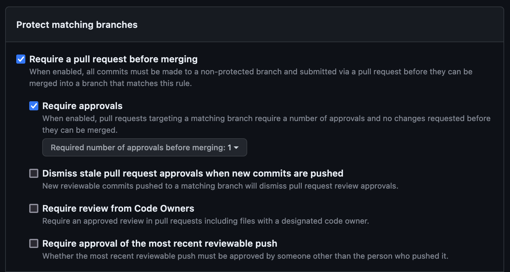

# Setting up Github permissions

If your using a repo that is in your personal git and not in the org. You will
need to add them as a collaborator.

In the org, people will inherit perms in personal they only get what you
explicitly grant.

#### Setting branch permissions

The below permissions, require a PR before merging and that PR will require
approval.

