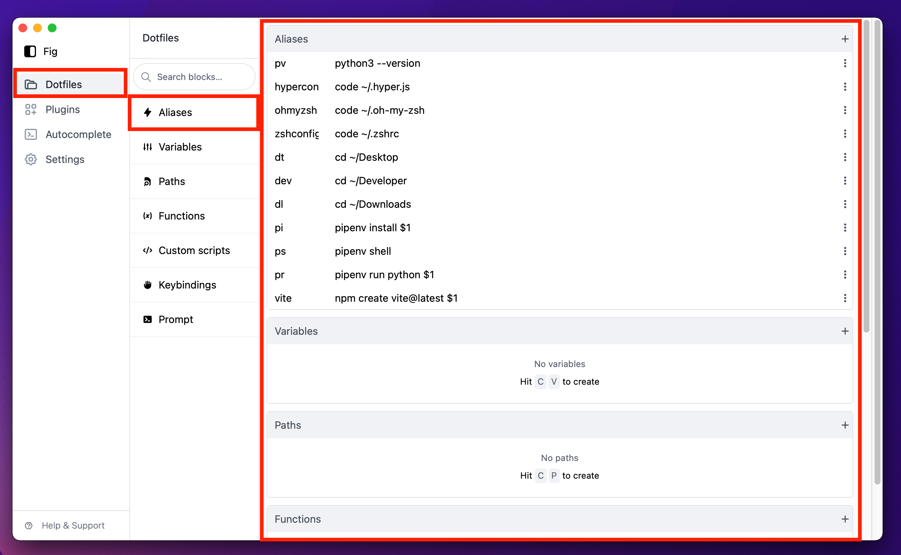

# Index Routes with React Route v6

So today I learnt how to display a child route as a default of a parent. Let me explain with this beautiful diagram.



When the user clicks on Dotfiles > The Aliases component is loading be default. Instead of just displaying nothing to the right of the links.

You can do this pretty simply with React Router in v6 you have to create an `index` route. Like so:

```js
<Routes>
    <Route path="/" element={<App />} />
        <Route path="dotfiles" element={<Dotfiles />}>
        <Route index element={<Aliases />} />
        <Route path="aliases" element={<Aliases />} />
        ...
```
    
With the above you have to wrap all your routes in a `<Routes></Routes>` block. You then specify each route as a child to `<Routes>` by using `<Route>`

You can see I have nested some routes here, the one we're looking out for is `<Route index element={<Aliases />} />` where I have used `index` this doesn't take a path as we're specifying this as an index which will load the component when a user clicks on route `dotfiles` route