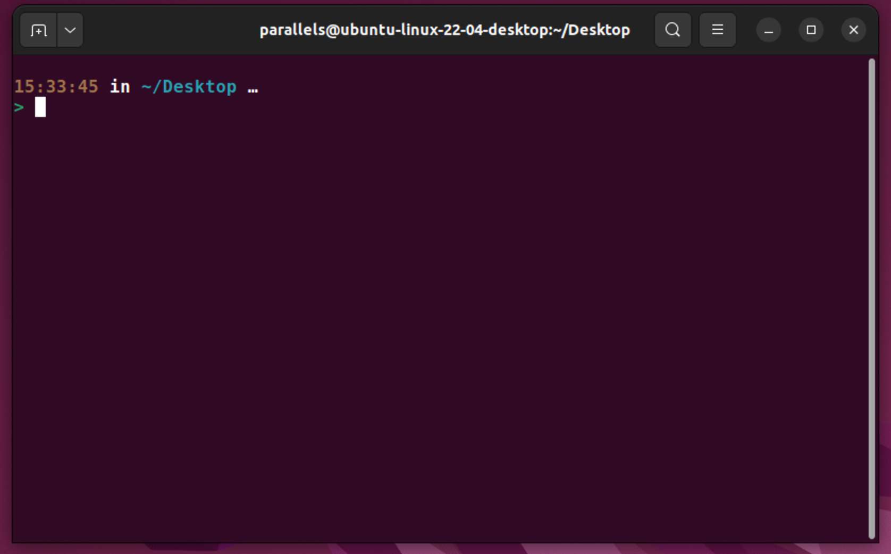

# How to install oh-my-zsh on Linux

### Step 1: Install and Setup ZSH

The first step before configuring the oh-my-zsh framework is to ensure we have
the ZSH shell installed. Run the following on Ubuntu.

```bash
sudo apt-get update && sudo apt-get install zsh
```

Once complete you can check that it's installed via `which zsh` which will
hopefully print out `/usr/bin/zsh`

### Step 2: Changing the default shell

Now we have ZSH installed it's time to swap out bash for zsh run:

```bash
chsh -s $(which zsh)
```

You will need to enter the admin password. Once that's done log out and log back
in. If you're using ZSH for the first time, open up the terminal and select
option `0`

### Step 3: Install and configure the oh-my-zsh framework

The next step after setting up ZSH is to install and configure the oh-my-zsh
framework. The simplest way to install the oh-my-zsh framework is to use the
provided installer script.

However, we need to ensure we have curl and git installed before downloading the
script.

```bash
sudo apt-get install git curl
```

Now install oh-my-zsh with the following:

```bash
sh -c "$(curl -fsSL https://raw.github.com/ohmyzsh/ohmyzsh/master/tools/install.sh)"
```

#### 3a. Install Spaceship via oh-my-zsh

You can pick your theme between the two below...

Clone this repo:

```zsh
git clone https://github.com/denysdovhan/spaceship-prompt.git "$ZSH_CUSTOM/themes/spaceship-prompt"
```

Symlink `spaceship.zsh-theme` to your oh-my-zsh custom themes directory:

```zsh
ln -s "$ZSH_CUSTOM/themes/spaceship-prompt/spaceship.zsh-theme" "$ZSH_CUSTOM/themes/spaceship.zsh-theme"
```

Set `ZSH_THEME="spaceship"` in your `.zshrc`. - If you want to use
[Spaceship](https://denysdovhan.com/spaceship-prompt/)

### 3c. Installing ZSH highlighting & auto-completetion

#### ZSH highlighting

Clone this repo:

```zsh
git clone https://github.com/zsh-users/zsh-syntax-highlighting.git ${ZSH_CUSTOM:-~/.oh-my-zsh/custom}/plugins/zsh-syntax-highlighting
```

Add `plugins=(zsh-syntax-highlighting)` to your plugins in your `.zshrc` file

#### ZSH auto-completion

Clone this repo:

```zsh
git clone https://github.com/zsh-users/zsh-autosuggestions ${ZSH_CUSTOM:-~/.oh-my-zsh/custom}/plugins/zsh-autosuggestions
```

Add `plugins=(zsh-autosuggestions)` to your plugins in your `.zshrc` file

For all the changes to take effect you will have to log out and back in. Your
termainl should now look like this:



Nioce 😎
